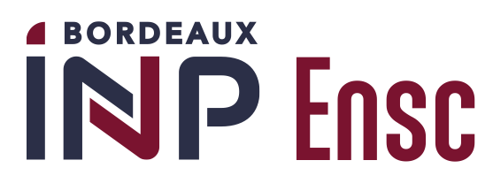

<br/>
<div align="center" >




# <u> ENSC Parcours IA </u>
## Data Challenge - Détection de clics d'odontocètes

</div>

## Authors

- [Tristan Gonçalves](https://github.com/tristangclvs)
- [Thomas Chimbault](https://github.com/thomaschlt)

## Context 

As part of the [Artificial Intelligence specialization](https://3aia.notion.site/3aia/Parcours-3A-IA-2023-9917027c682b457dae71fea68c067ad1) at the [ENSC](https://ensc.bordeaux-inp.fr/fr), we participated in a data challenge provided by the University of Toulon in the [ChallengeData](https://challengedata.ens.fr/) website. 

This challenge specifically aims to detect the presence of odontoceti clicks in underwater audio recordings in the Caribbean sea.
The model will be evaluated on the [ChallengeData](https://challengedata.ens.fr/) website.

## Data Description

The dataset is composed of 23,168 audio files in WAV format, each of duration 200ms. The clicks are labeled with a binary variable: 1 if the file contains a click, 0 otherwise.

## Challenge

The objective of the challenge is to create a model that predicts the presence of odontoceti clicks in the test set with the highest accuracy.

## Evaluation

The submissions are evaluated on the ROC AUC (area under the curve) metric. 

The submissions must be a CSV file with 950 lines. Each line corresponds to a file of the test set and contains the prediction for this file. The prediction en percentage should be indicated and must not be rounded to binary labels.

## Our approach

We first used classical machine learning model, such as `Linear Regression` or `Random Forest`.

We also used a Convolutional Neural Network to classify the audio files. We used the [Librosa](https://librosa.org/doc/latest/index.html) library to extract the audio features.

## Results
### Classical approaches
- Logistic Regression
- Decision Tree
- Bagged Tree
- Random Forest
- XGBoost 
<div align="center">
<table>
    <tr>
        <th>Method</th>
        <th>Result</th>
    </tr>
    <tr>
        <td>Logistic Regression</td>
        <td>0.5981</td>
    </tr>
    <tr>
        <td>Decision  Tree</td>
        <td>06124</td>
    </tr>
    <tr>
        <td>Bagged Tree</td>
        <td>0.6351</td>
    </tr>
    <tr>
        <td>Random Forest</td>
        <td>0.6460</td>
    </tr>
    <tr>
        <td>XGBoost</td>
        <td>0.6301</td>
    </tr>
</table>
</div>
## Installation

To run the code in this repository, you will need to install `poetry`:
```bash
pip install poetry
```
Next, you may install all the necessary dependencies using 
```bash
poetry install
```

 ## <u> Repository Structure </u>

The repository is structured as follows:

<!-- - **`.dataset`**: contains the training and test sets used for the challenge. -->
- **[`images`](/images/)**: contains the images used in the README file.
- **[`notebooks`](/notebooks/)**: contains the notebooks used for the challenge, as well as the results.
<!-- - **`saved_models`**: contains the trained models. -->
<!-- - **`src`**: contains the scripts used for the challenge.  -->
